# Internship-Week1-Modernize
Internship-Week1-Modernize: CRUD Admin and Home Page for a Clinic Website (PHP OOP and MVC)
  

    <h1><ins>Gestion d'un Cabinet Traumatologie</ins></h1> 

<h4> <ins>Contexte du projet</ins></h4>

Le docteur Ahmed Mohcine est un traumatologue qui souhaite renforcer sa présence sur le web
et informatiser la gestion de ses patients.
<ul>
  • Un patient est défini par son nom, prénom, date de naissance, Num Tél, email et sa
        maladie.
</ul>
<ul>
  • Un médecin est définie par son nom, prénom, date de naissance et sa spécialité.
</ul>
Vous êtes amenés à réaliser un site Web qui contient au moins :
<ul>
    • Une page publicitaire du cabinet.

</ul>
<ul>
    • Une page de gestion des patients (Ajouter, Modifier, Supprimer).
</ul>
Votre client sollicité vos compétences en tanque web designer afin que vous lui proposer :
<ul>
    • Une charte graphique adéquat du Site.

</ul>
<ul>
    • Un prototype du Site.
</ul>

Votre client sollicité vos compétences en tanque développeur Front-end afin de lui
<ul>
    • Réaliser une page publicitaire de son cabinet cabinet avec du contenu à vous de choisir (
        slider d'image, galerie,...)

</ul>
<ul>
    • Réaliser page qui contient un formulaire pour Ajouter, Modifier ou Supprimer des
      patients
</ul>
votre client solicite vos compétences en tanque développeur Back-end afin de lui
<ul>
    • Réaliser une conception qui répond à ses besoin.

</ul>
<ul>
    • Implémenter la logique du backend avec le PHP.
</ul>
<ul>
    • Intégrer le front-end et Back-end
</ul>
Vous êtes amenés à faire des réunion de validation avec le Product owner (représenté par
l’encadrent ) à chaque phase de projet
<ol>
     <b>I. Conception :</b>
      Tenir en compte la modélisation fournit du cas présenté : 
        <ul>Diagramme de Cas d'utilisations</ul>
        <ul>Diagramme de de Classes</ul>
</ol>
<ol>
    <b>II. Développement front end :</b>
       <ul>Réaliser la structure de l'application avec HTML/CSS (Bonus :SASS)</ul>
       <ul>Implémenter les interfaces de l'application Implémenter la validation des champs des formulaires
        avec du Javascript (Regex)</ul>
</ol>
<ol>
    <b>III. Création de la base de données :</b>
       <ul>Manipuler et tester des requêtes SQL sur PHPMyAdmin</ul>
       <ul>Créer la base de données à partir de la conception validée pour le SGBD MySQL.</ul>
</ol>

IV. Développement Back end
<ol>
    <b>III. Création de la base de données :</b>
       <ul>Manipuler et tester des requêtes SQL sur PHPMyAdmin</ul>
       <ul>Créer la base de données à partir de la conception validée pour le SGBD MySQL.</ul>
</ol>
<h4> <ins>Modalités</ins></h4>
Modalités de travail : Travail par Binôme
Temporalité : 6 jours
<h4> <ins>Livrables</ins></h4>
Lien du Repo Github contenant tout le travail réalisé à chaque phase comme mentionné au
contexte. 
----------------------------------------------------------------------------------------------------------------------------
<h4 align="center" > <ins>Login Page</ins></h4>

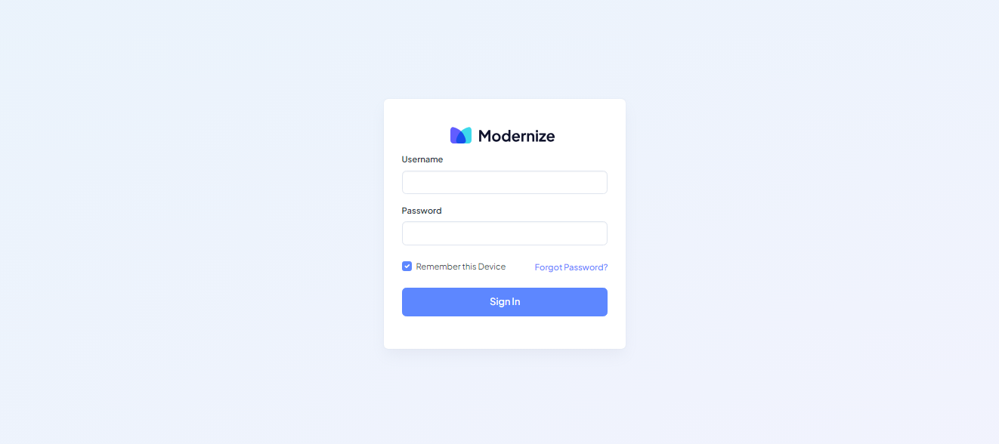

-------------------------------

<h4 align="center" > <ins>Dashboard Page</ins></h4>

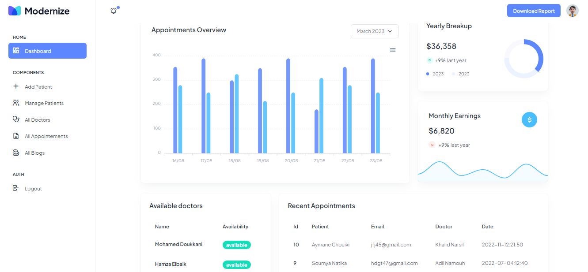

-------------------------------

<h4 align="center" > <ins>Add Patient Page</ins></h4>

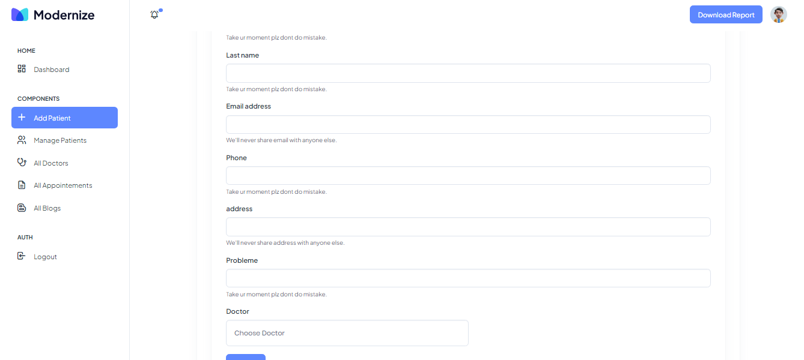

-------------------------------

<h4 align="center" > <ins>Manage Patients Page</ins></h4>

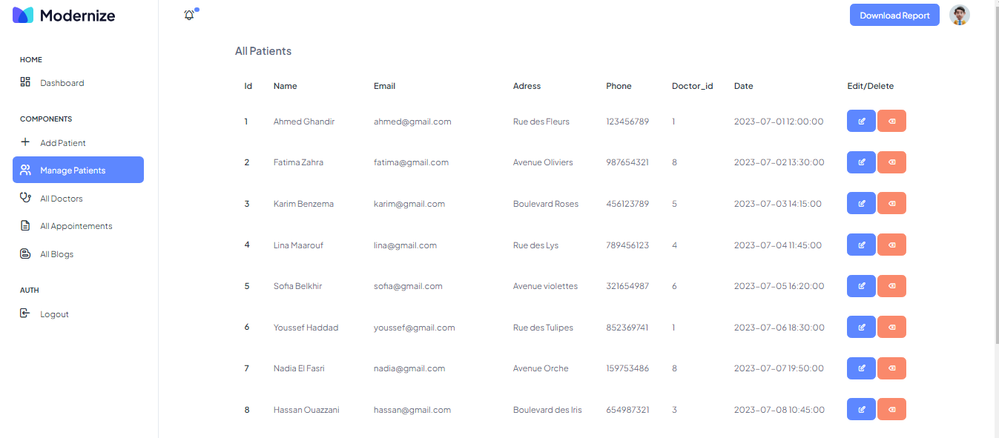

-------------------------------

<h4 align="center" > <ins>All Doctors Page</ins></h4>

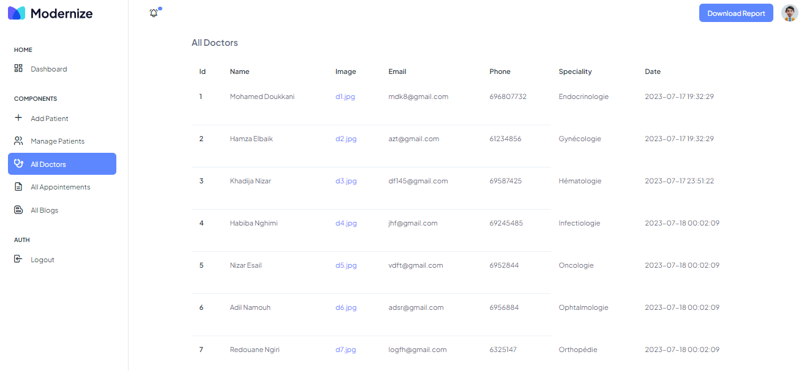

-------------------------------

<h4 align="center" > <ins>All Blogs Page</ins></h4>

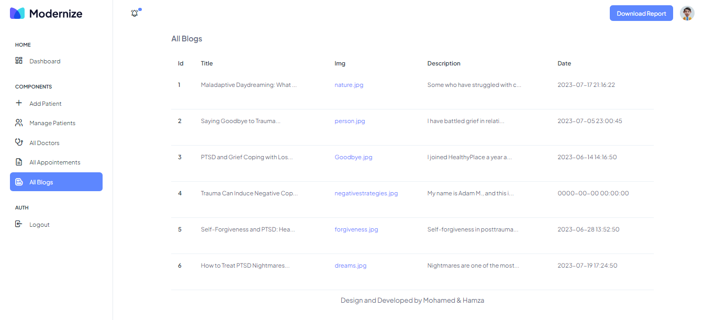

-------------------------------

<h4 align="center" > <ins>All Appointements Page</ins></h4>

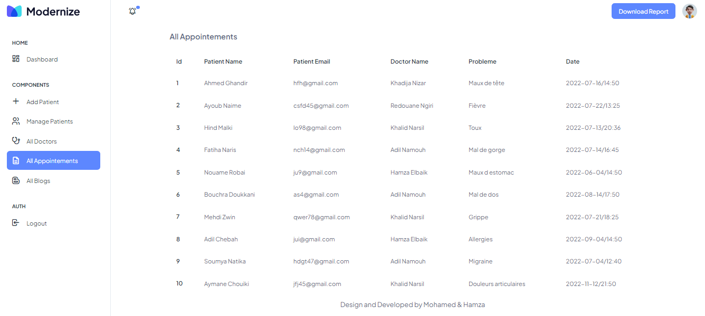

-------------------------------

<h4 align="center" > <ins>Home Page</ins></h4>

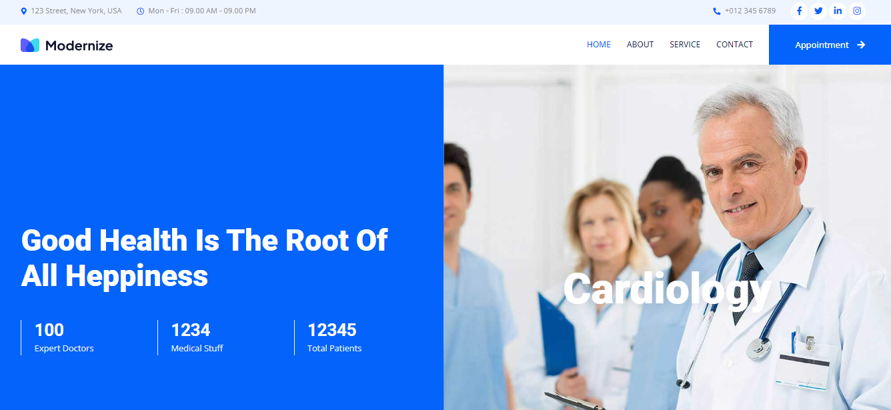

-------------------------------

<h4 align="center" > <ins>About</ins></h4>

-------------------------------

<h4 align="center" > <ins>Service</ins></h4>

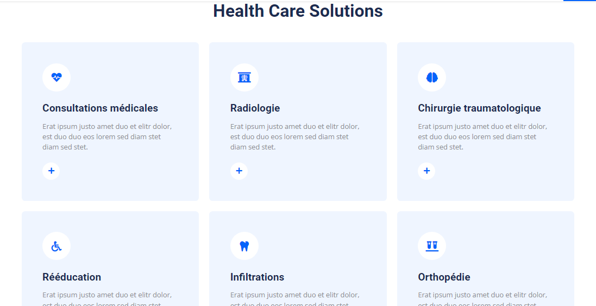

-------------------------------

<h4 align="center" > <ins>Take an Appointement</ins></h4>

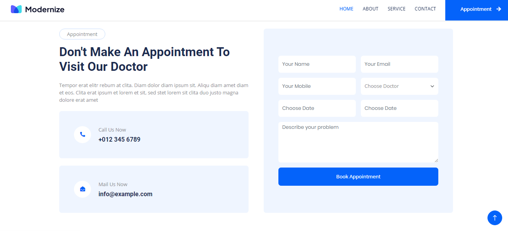

-------------------------------

<h4 align="center" > <ins>Contact</ins></h4>

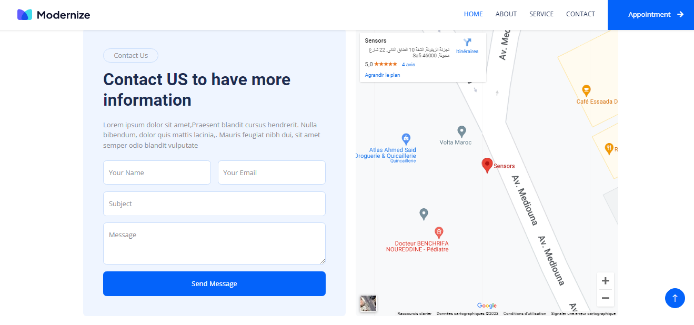

